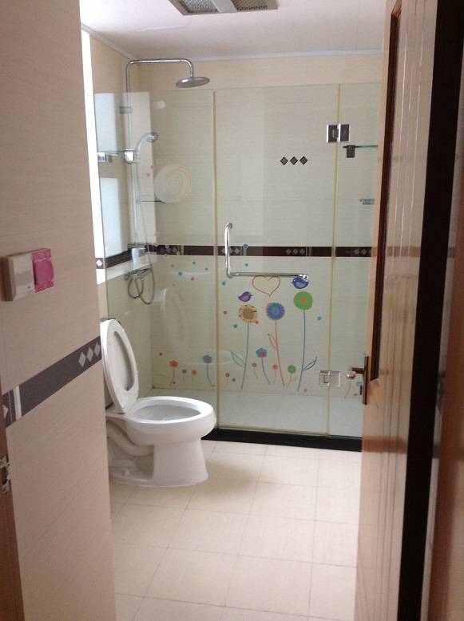

# Starting up in Shanghai

To start your life in Shanghai smoothly..
I picked several topic up in the case of my moving.

#### Basic information

- RMB

You can exchange at bank, or can get at cash dispenser. Please make sure that your card can use PLUS or Cirrus. Also available at airport or hotel, but it is expensive.

- Language

Basically local person don't speak English.

- Transportation

There is not time table on train or bus. Transportation like SUICA is available. Last train is not so late.

If you use taxi, 大众，強生，海博 will be relatively reliable. The color or veacle is blue or green. You can check by it.

#### Link

- [Moving to Shanghai](http://www.expatarrivals.com/china/shanghai/moving-to-shanghai)

- [上海赴任](http://www.shanghai-funin.com/)

Now we can find great article on here :

- [16 things to know before moving to Shanghai](http://www.timeoutshanghai.com/features/Blog-Around_Town/29449/16-things-to-know-before-moving-to-Shanghai.html)

- [14 sights you see on Shanghai metro](http://www.timeoutshanghai.com/features/Blog-Around_Town/28687/14-sights-you-see-on-the-Shanghai-metro-.html)

-----
This is not my home

